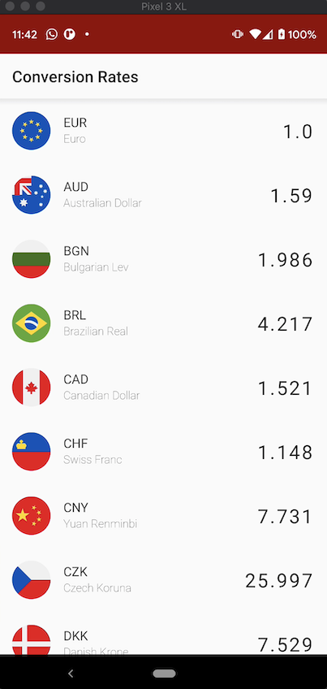
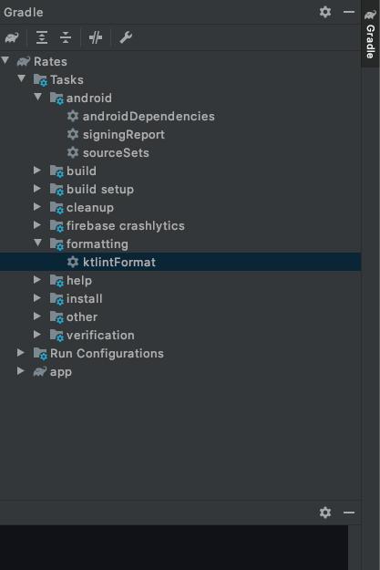
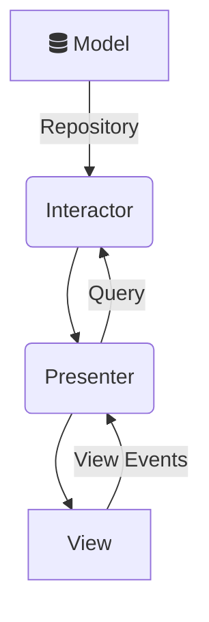
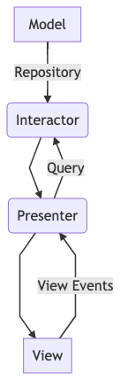

# Rates
Rates is a currency rate conversion application with the ability to
* Display live currencies and associated value at interval realtime.
* Select First Responder (A reference to which other currencies are valued).
* Live Editing (A binding-editing property that allows a single field edit to bind to other fields)

## Demo
Click on image below to watch video demo on youtube.

[](https://youtu.be/ZClg2YICWJQ)

## Language
[Kotlin](https://kotlinlang.org/)

## Required Operating System Services
* **Internet:** 
Rates application uses internet to fetch data therefore it is compulsory for internet to be available on the device that runs Rates app.
## Supported Devices
Rates app support Android devices with operating system with API Level 21 (Lollipop) and above.
## How To build
You need to setup android studio to build Rates application. 
Use this link to [setup](https://developer.android.com/studio/install) android studio
## Running the App
After downloading and building the project on Android studio,
follow this [link](https://developer.android.com/training/basics/firstapp/running-app) on how to run the app.

## Running Unit Tests
The Unit tests are in `/app/src/test` directory. Run test individually.

## Running Instrumentation Tests
You can run the instrumentation test on either emulator or real device, I strongly recommend 
real device as Instrumentation test result can be flaky on emulator.
Turn off animations on device settings before running instrumentation test.
Instrumentation test files can be found in `/app/src/androidTest` directory.
Here is a quick [guide](https://developer.android.com/training/testing/unit-testing/instrumented-unit-tests) on running instrumentation test.

## Lint
You can run lint check with `./gradlew ktlint` or on Android Studio right pannel, select Gradle, then navigate to
`Rates -> Tasks -> formatting -> ktlintFormat` double-click ktlintFormat and **Ktlint** will run a format check on
the entire project.




## Release
To build a release version of Rates application, update `gradle.properties` file with this

```
RELEASE_STORE_FILE=(path to release store file)
RELEASE_STORE_PASSWORD=*****
RELEASE_KEY_ALIAS=*****
RELEASE_KEY_PASSWORD=*******

```

Fill the above as required.

## Architecture

Model View Presenter architecture was chosen to build **Rates** app. 
**Note**: There are many architectures for building android application such as **MVVM**, **MVI**, **MVC**, ... 
MVP was chosen because of easy modularization, scaling and use case testing.

### Architecture Diagram




*(Backup, if mermaid is not enabled on browser)*

From the [Mermaid](https://mermaid-js.github.io/mermaid/) flow diagram above, Rates app uses a modified Model View Presenter (MVP)
architecture. The modification is around using Interactors for specific **Use Case** , that way, we only query what we need from the repository and not load the entire repository in the **Presenter**. 
There are many articles on MVP architecture online, check [this](https://www.raywenderlich.com/7026-getting-started-with-mvp-model-view-presenter-on-android) article from Raywenderlich for some knowledge on this architecture.

### Tools
Rates application uses some dedicated tools for some specific operations.

* *[Rxjava](https://github.com/ReactiveX/RxJava)* -> Asynchronous operations and data flow.
* *[Retrofit](https://github.com/square/retrofit)* -> Network request
* *[RxRelay](https://github.com/JakeWharton/RxRelay)* -> Asynchronous stream
* *[Mock Web Server](https://github.com/square/okhttp/tree/master/mockwebserver)* -> Mock response for Instrumentation testing
* *[Mockk](https://github.com/mockk/mockk)* -> For mocking models in Unit testing
* *[Ktlint](https://github.com/pinterest/ktlint)* -> For code format check
